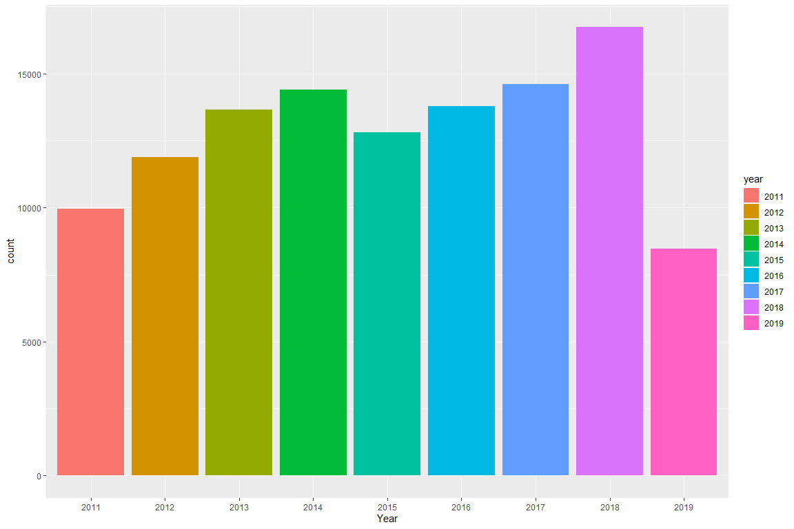
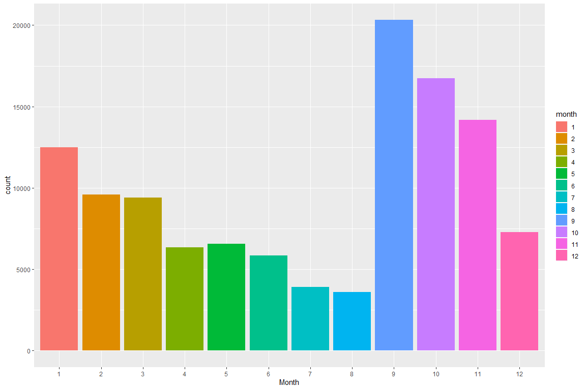
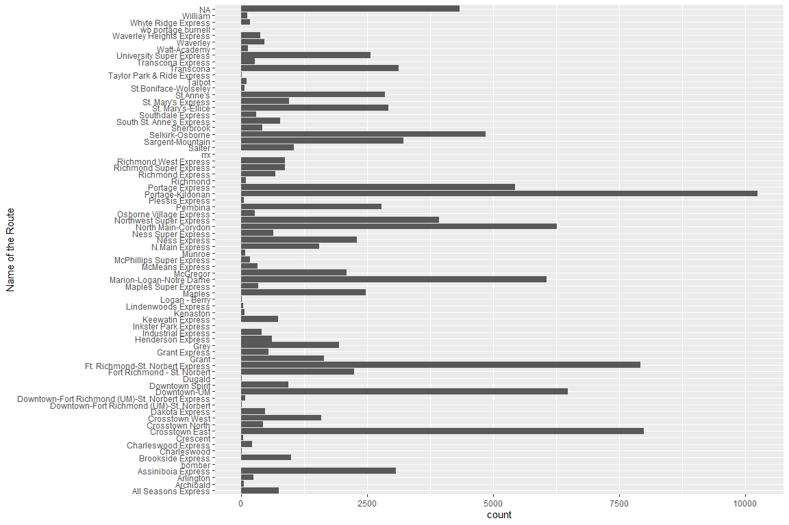

Playing Around with Winnipeg Transit Data
================
Marcello Nesca
July 2 2019

## Motivation(s) & Objectives

The idea of this practice dataset is:  
1\) to upkeep my data science skills in R  
2\) playing with version control using Github  
3\) Store my thoughts on data analysis  
4\) i want to practice more on Tidyverse code and stop using BASE R
coding

Here is my initial startup for all the packages and options im
running.  
library(here)  
library(tidyverse)  
library(stringr)  
library(lubridate)  
knitr::opts\_chunk$set(fig.width = 12, fig.height = 8)

## Loading Datasets

I have obtained this dataset from the City of Winnipeg open dataset
archive I will be concentrating on utilizing the Transit-passups for
this practice project. Since this dataset gets updated daily, I have
gotten this dataset in June 29th 2019.

UPDATE: 08-24-2019: I had accidently deleted my data file somehow, and
so I re-downloaded a new dataset on August 22nd 2019.

Ref: <https://data.winnipeg.ca/Transit/Transit-Pass-ups/mer2-irmb>

## Data Cleaning and Checking Variables (AKA - preprocessing)

Here I want to describe what my variables initially look like before
further analysis. We first need to see what variables are included
without continiously looking at the dataframe. The idea is to try to be
efficient in your work.

UPDATE 07-31-2019: definitely by practice, cleaning and visualizing data
is a circular process.

Here are a list of the variables uncleaned:

``` r
sumvar <- summary(transitdata)
print(sumvar)
```

    ##    Pass-Up ID      Pass-Up Type           Time            Route Number   
    ##  Min.   : 363450   Length:116321      Length:116321      Min.   :  1.00  
    ##  1st Qu.:1238820   Class :character   Class :character   1st Qu.: 18.00  
    ##  Median :1871030   Mode  :character   Mode  :character   Median : 36.00  
    ##  Mean   :1802710                                         Mean   : 59.64  
    ##  3rd Qu.:2488608                                         3rd Qu.: 75.00  
    ##  Max.   :2981877                                         Max.   :185.00  
    ##                                                          NA's   :49      
    ##   Route Name        Route Destination    Location        
    ##  Length:116321      Length:116321      Length:116321     
    ##  Class :character   Class :character   Class :character  
    ##  Mode  :character   Mode  :character   Mode  :character  
    ##                                                          
    ##                                                          
    ##                                                          
    ## 

### Renaming, and changing variables to factors

``` r
transitdata <- transitdata %>% 
  dplyr::rename(RouteDestination = `Route Destination`) %>%
  dplyr::rename(RouteName = `Route Name`) %>%
  dplyr::rename(PassUpType = `Pass-Up Type`) %>%
  dplyr::rename(RouteNumber = `Route Number`) %>%
  dplyr::rename(PassUpID = `Pass-Up ID`) %>%
  mutate_at(vars("RouteDestination", "RouteName", "PassUpType", "RouteNumber"), as.factor)
```

#### Testing the renamed variables

``` r
ggplot(transitdata) +
  geom_bar(aes(PassUpType, fill = PassUpType)) +
  xlab("Type of bus that passed")
```

<!-- -->

### Changed longitude and latitude

For potential spatial analysis in the future

``` r
transitdata <- transitdata %>%
  separate(Location, into = c("Extra", "Lat1", "Long1"), sep = " ") %>%
  separate(Lat1, into = c("Extra1", "Latitude"), sep = 1) %>%
  separate(Long1, into = c("Longitude", "Extra2"), sep = -1) %>%
  select(-Extra, -Extra1, -Extra2)
```

### splitting up time and date

Here is where we clean the time variable - i want to lubridate the time
variable first, then split up time and date

``` r
transitdata <- transitdata %>%
  mutate(Time = mdy_hms(Time)) %>%
  separate(Time, into = c("Date", "Clock"), sep = " ")
```

Creating new variables for splitting up dates into months days and years

``` r
transitdata <- transitdata %>%
  mutate(year = year(Date), 
         month = month(Date), 
         day = day(Date),
         ) %>%
  mutate_at(vars("year", "month", "day"), as.factor) 
```

UPDATE 08-10-2019:  
some possible solutions for categorical splitting: 1) derive only the
top 10 and bottom 10 passups so filter by most frequent and least
frequent  
2\) create a category for day of the week “Monday tuesday etc”  
3\) create a category for subgroup by region in winnipeg  
4\) create a category for what type of speed bus “super express, rapid
transit, etc”

``` r
transitdata <- transitdata %>%
  mutate(bus_speed = ifelse(RouteNumber %in% c(137,160,161,162,163,170,180,181,183,185), 'RapidTransit',
                            ifelse(RouteNumber %in% c(101,102,109,110), 'Dart',
                                   ifelse(RouteNumber %in% c(1,2,3), 'DowntownSpirit',
                                          ifelse(RouteNumber %in% c(21,22,24,28,30,31,32,40,41,42,46,48,54,57,58,59,64,65,67), 'Express',
                                                 ifelse(RouteNumber %in% c(25,34,35,36), 'SuperExpress', 'Regular'))))))
```

number 4 check\! Now lets visualize\!

``` r
transitdata <- transitdata %>%
  mutate(dayofweek = wday(Date, label = TRUE, abbr = FALSE))
```

number 2 check\!

It seems that I have cleaned everything I wish to clean, I have
separated all the variables in their component parts including the
dates\! So now lets explore some data finally\!

## Exploratory Analysis (Mostly Univariate Analysis on most variables)

A ton of these visualizations are primarily hypothesis generating, but
also for the most part for my own practice sake.

``` r
ggplot(transitdata) +
  geom_bar(aes(year, fill = year)) +
  xlab("Year")
```

<!-- -->

Wow\! Interesting exploratory information\! The rate of pass-ups are
increasing per year since 2015\! however in 2015 it did go down from
2014. 2019 is a half year since i downloaded the data end of June 2019.

questions derived from this analysis (either answerable or unanswerable
via data):  
1\) what caused the increase in pass ups from 2014-2018?  
2\) is it possible to join another table for extra insights, if so, what
would be the common id?

``` r
ggplot(transitdata) +
  geom_bar(aes(month, fill = month)) +
  xlab("Month")
```

<!-- -->

and this is clearly very interesting\! most of the passups occur when –
you guessed it\! school is starting\!

``` r
transitdata %>%
  filter(bus_speed == 'RapidTransit', year %in% c('2018')) %>%
  ggplot(aes(day, fill = day)) +
    geom_bar() +
    facet_wrap(~ year) +
    xlab("Day")
```

<!-- -->

``` r
ggplot(transitdata) +
  geom_bar(aes(fct_infreq(bus_speed), fill = bus_speed)) +
  facet_wrap(~ year, nrow = 4) +
  theme(axis.text.x=element_blank(),
        axis.ticks.x=element_blank()) +
  xlab("Type of bus speed") +
  ylab("count of passups")
```

<!-- -->

``` r
# two categorical variables - dotmap by year
ggplot(transitdata) +
  geom_count(aes(year, bus_speed))
```

<!-- -->

``` r
# two categorical variables - heatmap by month
transitdata %>% 
  count(month, bus_speed) %>%  
  ggplot(aes(month, bus_speed)) +
    geom_tile(aes(fill = n))
```

<!-- -->

``` r
#Finding out which busses are the culprits! 
transitdata %>%
  filter(bus_speed == 'Regular') %>%
  ggplot(aes(fct_infreq(RouteNumber))) +
    geom_bar(na.rm = TRUE) +
    xlab("RouteNumber")
```

<!-- -->

``` r
transitdata %>%
  filter(year == '2018') %>%
  ggplot(aes(month)) +
    geom_bar() +
    xlab("Month for current year")
```

<!-- -->

``` r
transitdata %>%
  filter(bus_speed %in% c('RapidTransit')) %>%
  ggplot(aes(RouteNumber, fill = RouteNumber)) +
    geom_bar() +
    facet_wrap(~ month, nrow = 4) +
    theme(axis.text.x=element_blank(),
        axis.ticks.x=element_blank()) +
    xlab("RouteNumber")
```

<!-- -->

``` r
transitdata %>%
  filter(bus_speed == 'Express') %>%
  ggplot(aes(fct_infreq(RouteNumber), fill = RouteNumber)) +  
    geom_bar() +
    xlab("RouteNumber")
```

<!-- -->

``` r
transitdata %>%
  filter(bus_speed %in% c('SuperExpress')) %>%
  ggplot(aes(RouteNumber, fill = RouteNumber)) +
    geom_bar(na.rm = TRUE) +
    xlab("RouteNumber")
```

<!-- -->

``` r
transitdata %>%
  filter(n() >= 4000) %>%
  ggplot(aes(fct_infreq(RouteNumber), fill = RouteNumber)) +
    geom_bar() +
    xlab("RouteNumber")
```

<!-- -->

``` r
transitdata %>%
  ggplot(aes(dayofweek, fill = dayofweek)) +
  geom_bar() +
  facet_wrap(~ month, nrow = 4) +
  theme(axis.text.x=element_blank(),
        axis.ticks.x=element_blank()) +
  xlab("Day of the Week")
```

<!-- -->

## Lessons Learned and Notes

This section will display all the errors, and difficulties I have
struggled with.

### No Spaces in variable names

If there is a space in the variable name, it will cause an error. I
initially thought its because i did not change the variables into
factors (which was also true) but it was not the cause of the error,
since it did not fix it.

``` r
ggplot(transitdata) +
  geom_bar(aes("Pass-Up Type")) +
  xlab("Type of bus that passed")
```

> "It seems this produced an error that I am trying to fix, the error in
> this case is that its outputting the total count of the variable under
> Route Destination which is not useful at all. I will try to fix this.
> 
> The issue was that the variables were characters to which i have to
> change to factors.
> 
> AAAAND… urgggg\! It seems like transforming the variables didnt work
> either\!\!"

> UPDATE: 07-21-2019: So I finally figured out why my GGPLOT geom bar is
> continiously breaking – it took me a week or so to figure this out. It
> is because GGPLOT *CANNOT* have spaces in the variables. Furthermore,
> spaces between variables is not good coding practice anyways, so… City
> of Winnipeg, do *NOT* put spaces in your variables.

### Sorting categorical variables by descending order

I struggled with this for the long time, trying to find a tidyverse way
of coding of sorting categories by decending order.

> I cannot seem to find a way to properly sort categorical variables but
> ill definitely find out by next time\! There are way too many values
> for these variables… Now a new problem to solve\!

> 08-22-2019: I learned something new\! forcats package is for all
> categorical variables… in this case i learned how to sort categorical
> variables by descending frequency.

### Variables with a ton of categories

I am still currently having an issue on how to deal with variables with
a ton of categories. I am trying to find a way to get top 10 results.

``` r
ggplot(transitdata) +
  geom_bar(aes(RouteDestination)) +
  coord_flip() +
  xlab("Where the bus went")
```

<!-- -->

``` r
ggplot(transitdata) +
  geom_bar(aes(RouteName)) +
  coord_flip() +
  xlab("Name of the Route")
```

<!-- -->
