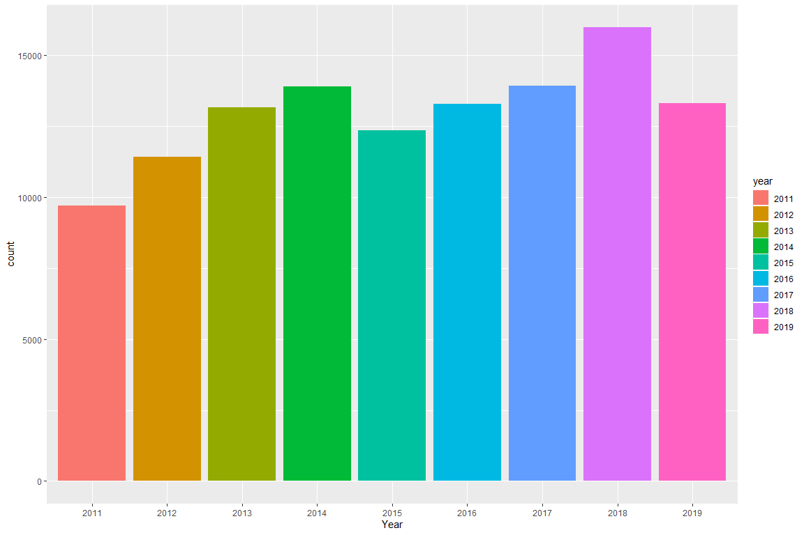
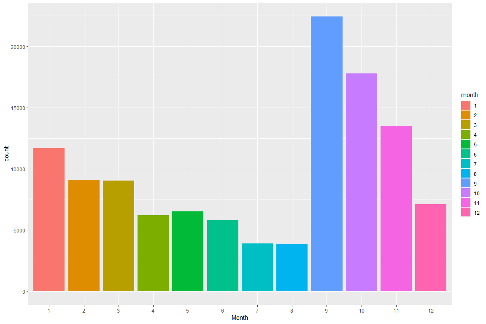
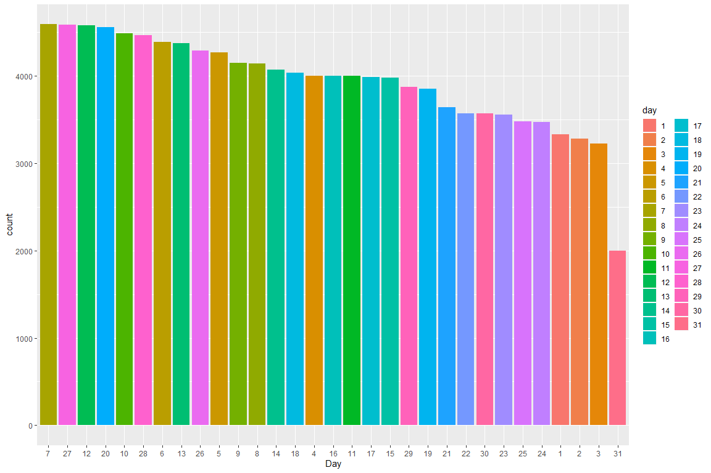
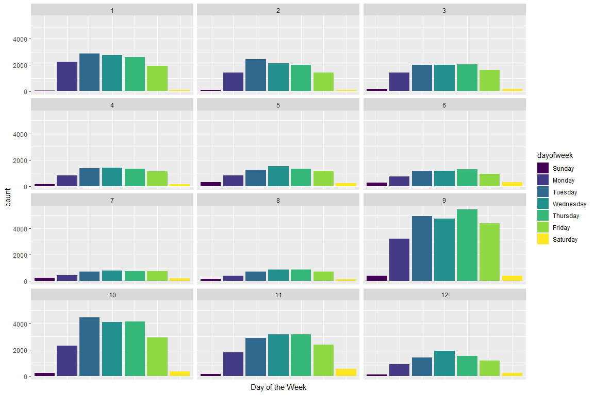
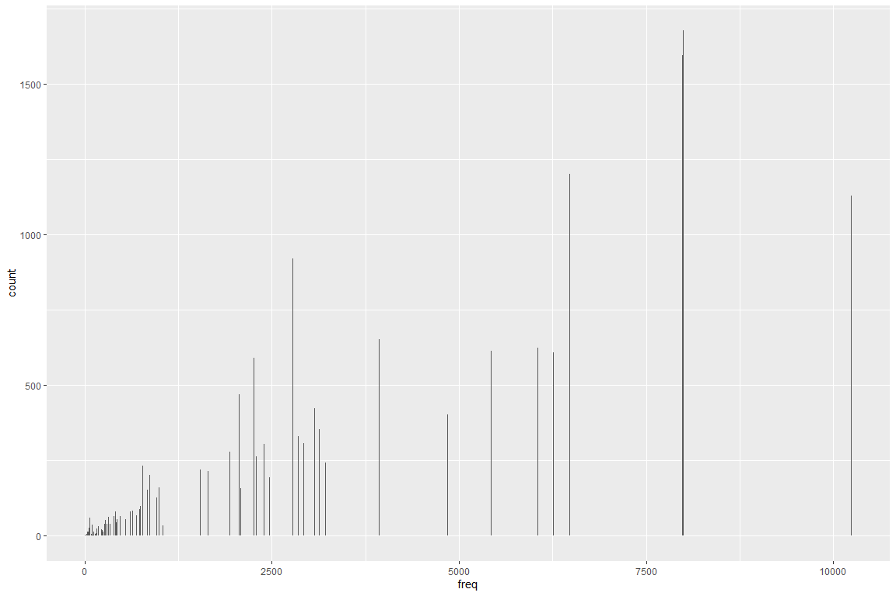
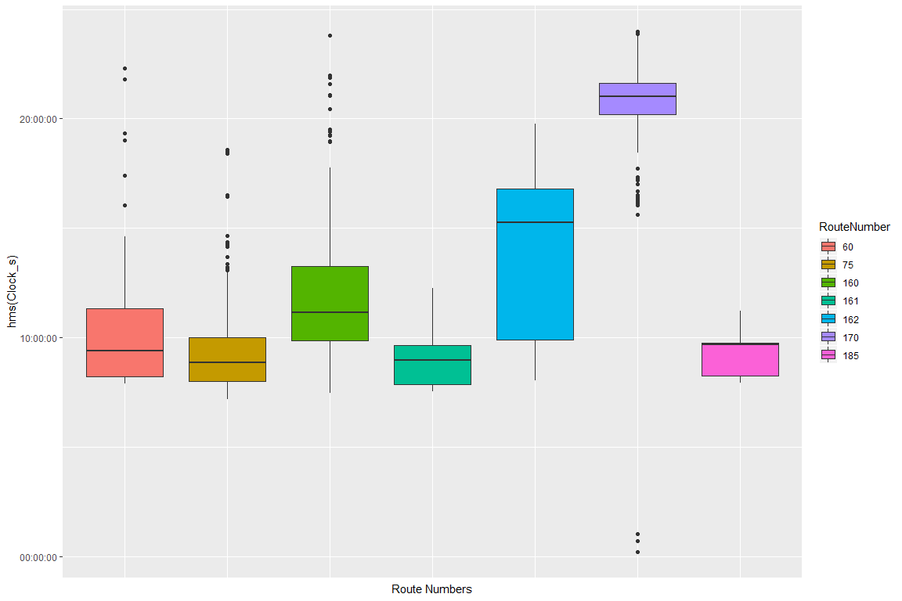
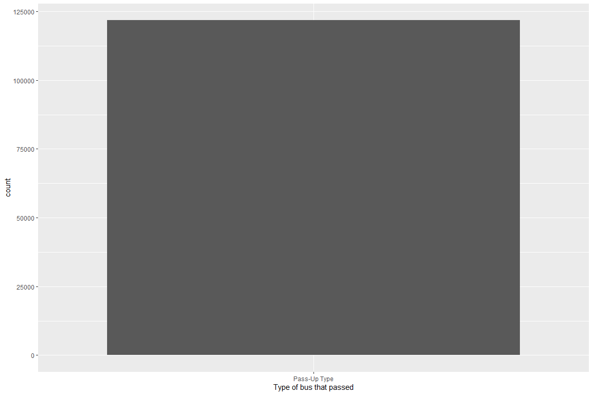

Playing Around with Winnipeg Transit Data
================
Marcello Nesca
July 2 2019

## Motivation(s) & Objectives

The idea of this practice dataset is:  
1\) to upkeep my data science skills in R  
2\) playing with version control using Github  
3\) Store my thoughts on data analysis  
4\) i want to practice more on Tidyverse code and stop using BASE R
coding

Here is my initial startup for all the packages and options im
    running.

``` r
library(here) 
```

    ## here() starts at C:/Users/mnesc/Sync/R Data Projects/corgi_cubicle

``` r
library(tidyverse)
```

    ## -- Attaching packages --------------------------------------- tidyverse 1.2.1 --

    ## v ggplot2 3.2.1     v purrr   0.3.3
    ## v tibble  2.1.3     v dplyr   0.8.3
    ## v tidyr   1.0.0     v stringr 1.4.0
    ## v readr   1.3.1     v forcats 0.4.0

    ## -- Conflicts ------------------------------------------ tidyverse_conflicts() --
    ## x dplyr::filter() masks stats::filter()
    ## x dplyr::lag()    masks stats::lag()

``` r
library(stringr)
library(hms)
library(knitr)
library(reprex)
library(datapasta)
opts_chunk$set(fig.width = 12, fig.height = 8)
```

## Loading Datasets

I have obtained this dataset from the City of Winnipeg open dataset
archive I will be concentrating on utilizing the Transit-passups for
this practice project. Since this dataset gets updated daily, I have
gotten this dataset in June 29th 2019.

UPDATE: 08-24-2019: I had accidently deleted my data file somehow, and
so I re-downloaded a new dataset on August 22nd 2019.

Ref: <https://data.winnipeg.ca/Transit/Transit-Pass-ups/mer2-irmb>

``` r
transitdata <- read_csv(here::here("data", "Transit_Pass-ups.csv"))
```

    ## Parsed with column specification:
    ## cols(
    ##   `Pass-Up ID` = col_double(),
    ##   `Pass-Up Type` = col_character(),
    ##   Time = col_character(),
    ##   `Route Number` = col_double(),
    ##   `Route Name` = col_character(),
    ##   `Route Destination` = col_character(),
    ##   Location = col_character()
    ## )

``` r
summary(transitdata)
```

    ##    Pass-Up ID      Pass-Up Type           Time            Route Number   
    ##  Min.   : 363450   Length:121779      Length:121779      Min.   :  1.00  
    ##  1st Qu.:1258908   Class :character   Class :character   1st Qu.: 18.00  
    ##  Median :1918299   Mode  :character   Mode  :character   Median : 36.00  
    ##  Mean   :1856796                                         Mean   : 60.47  
    ##  3rd Qu.:2546339                                         3rd Qu.: 75.00  
    ##  Max.   :3028878                                         Max.   :185.00  
    ##                                                          NA's   :49      
    ##   Route Name        Route Destination    Location        
    ##  Length:121779      Length:121779      Length:121779     
    ##  Class :character   Class :character   Class :character  
    ##  Mode  :character   Mode  :character   Mode  :character  
    ##                                                          
    ##                                                          
    ##                                                          
    ## 

## Data Cleaning and Checking Variables (AKA - preprocessing)

Here I want to describe what my variables initially look like before
further analysis. We first need to see what variables are included
without continiously looking at the dataframe. The idea is to try to be
efficient in your work.

UPDATE 07-31-2019: definitely by practice, cleaning and visualizing data
is a circular process.

### Renaming, and changing variables to factors

``` r
transitdataclean <- transitdata %>% 
  rename(RouteDestination = `Route Destination`) %>%
  rename(RouteName = `Route Name`) %>%
  rename(PassUpType = `Pass-Up Type`) %>%
  rename(RouteNumber = `Route Number`) %>%
  rename(PassUpID = `Pass-Up ID`) %>%
  mutate_at(vars("RouteDestination", "RouteName", "PassUpType", "RouteNumber"), as.factor) %>%
  drop_na()
  # count(fct_explicit_na(RouteNumber), fct_explicit_na(RouteDestination), sort = TRUE)
```

### splitting up time and date

Here is where we clean the time variable - i want to lubridate the time
variable first, then split up time and date

``` r
starttime <- hms::hms(00, 30, 05)
```

``` r
transitdataclean <- transitdataclean %>%
  mutate(Time = lubridate::mdy_hms(Time)) %>%
  separate(Time, into = c("Date", "Clock"), sep = " ") %>%
  mutate(Clock_s = as_hms(Clock)) %>%
  mutate_at(vars("Clock_s"), as.numeric)
```

This next line of code is to subtract the time in which the bus passed
up to the ‘assumed’ start time of 05:30 which is when busses get issued.
As a result it counts the amount of seconds from 5:30am to when the bus
passed up. The reason why i did this is because i want to see on average
what time busses passup and which routes passup the most at certain
times during the day.

I of course expect rush hour but the data should see where this truly
lies.

``` r
transitdataclean <- transitdataclean %>%
  mutate(timetopassup = as_hms(Clock) - as_hms(starttime)) %>%
  mutate_at(vars("timetopassup"), as.numeric)
```

``` r
library(tidyverse)
transitdataclean <- transitdataclean %>%
  mutate(timetopassuphms = hms::hms(timetopassup))
```

Creating new variables for splitting up dates into months days and years

``` r
transitdataclean <- transitdataclean %>%
  mutate(year = lubridate::year(Date), 
         month = lubridate::month(Date), 
         day = lubridate::day(Date),
         ) %>%
  mutate_at(vars("year", "month", "day"), as.factor) 
```

UPDATE 08-10-2019:  
some possible solutions for categorical splitting: 1) derive only the
top 10 and bottom 10 passups so filter by most frequent and least
frequent  
2\) create a category for day of the week “Monday tuesday etc”  
3\) create a category for subgroup by region in winnipeg  
4\) create a category for what type of speed bus “super express, rapid
transit, etc”

``` r
transitdataclean <- transitdataclean %>%
  mutate(bus_speed = ifelse(RouteNumber %in% c(137,160,161,162,163,170,180,181,183,185), 'RapidTransit',
                            ifelse(RouteNumber %in% c(101,102,109,110), 'Dart',
                                   ifelse(RouteNumber %in% c(1,2,3), 'DowntownSpirit',
                                          ifelse(RouteNumber %in% c(21,22,24,28,30,31,32,40,41,42,46,48,54,57,58,59,64,65,67), 'Express',
                                                 ifelse(RouteNumber %in% c(25,34,35,36), 'SuperExpress', 'Regular'))))))
## number 4 check!
```

``` r
transitdataclean <- transitdataclean %>%
  mutate(dayofweek = lubridate::wday(Date, label = TRUE, abbr = FALSE))
## number 2 check!
```

``` r
transitdataclean <- transitdataclean %>%
  mutate(numdest = ifelse(RouteNumber %in% c(1,2,20,25,24,26,34,39,40,42,48,49,50,55,60,61,63,64,65,74,78,80,81,160,161,180,181,185), '1 Destination',
                            ifelse(RouteNumber %in% c(3,12,29,31,32,36,38,41,43,45,46,57,58,67,70,79,163,170,183), '2 Destinations',
                                   ifelse(RouteNumber %in% c(10,11,14,15,16,17,18,19,21,22,28,33,35,37,44,47,54,59,62,66,68,71,75,77,137,162), '3+ Destinations', 'No Passups' ))))
```

``` r
## need to recheck code


#transitdataclean <- transitdataclean %>%
#  mutate(newnumdest <- fct_collapse(transitdataclean$numdest,
#  onedestination = c("1 Destination", "No Passups"),
#  twodestinations = c("2 Destinations"),
#  threeplusdestinations = c("3+ Destinations")
#)) %>%
#  select(-numdest)
```

It seems that I have cleaned everything I wish to clean, I have
separated all the variables in their component parts including the
dates\! So now lets explore some data finally\!

## Exploratory Analysis (Mostly Univariate Analysis on most variables)

A ton of these visualizations are primarily hypothesis generating, but
also for the most part for my own practice sake.

``` r
library(tidyverse)
transitdataclean %>%
ggplot(aes(year, fill = year)) +
  geom_bar() +
  xlab("Year")
```

<!-- -->

Wow\! Interesting exploratory information\! The rate of pass-ups are
increasing per year since 2015\! however in 2015 it did go down from
2014. 2019 is a half year since i downloaded the data end of June 2019.

questions derived from this analysis (either answerable or unanswerable
via data):  
1\) what caused the increase in pass ups from 2014-2018?  
2\) is it possible to join another table for extra insights, if so, what
would be the common id?

``` r
transitdataclean %>%
ggplot(aes(month, fill = month)) +
  geom_bar() +
  xlab("Month")
```

<!-- -->

and this is clearly very interesting\! most of the passups occur when –
you guessed it\! school is starting\!

``` r
transitdataclean %>%
  ggplot(aes(fct_infreq(day), fill = day)) +
    geom_bar() +
    xlab("Day")
```

<!-- -->

``` r
transitdataclean %>%
  ggplot(aes(dayofweek, fill = dayofweek)) +
  geom_bar() +
  facet_wrap(~ month, nrow = 4) +
  theme(axis.text.x=element_blank(),
        axis.ticks.x=element_blank()) +
  xlab("Day of the Week")
```

<!-- -->

``` r
transitdataclean %>% 
  group_by(RouteNumber) %>%
  mutate(freq = n()) %>%
  filter(freq > 5000, 
         PassUpType == 'Full Bus Pass-Up',
         year == '2018') %>%
  print(transitdata) %>%
  ggplot(aes(fct_infreq(RouteNumber))) +
    geom_bar()
```

    ## # A tibble: 7,454 x 18
    ## # Groups:   RouteNumber [7]
    ##    PassUpID PassUpType Date  Clock RouteNumber RouteName RouteDestination
    ##       <dbl> <fct>      <chr> <chr> <fct>       <fct>     <fct>           
    ##  1  2816870 Full Bus ~ 2018~ 18:2~ 11          Portage-~ City Hall       
    ##  2  2816646 Full Bus ~ 2018~ 17:4~ 11          Portage-~ Via Donwood     
    ##  3  2816462 Full Bus ~ 2018~ 21:3~ 11          Portage-~ Via Glenway     
    ##  4  2816449 Full Bus ~ 2018~ 20:0~ 11          Portage-~ Via Glenway     
    ##  5  2816287 Full Bus ~ 2018~ 14:4~ 18          North Ma~ To Corydon & Ed~
    ##  6  2816088 Full Bus ~ 2018~ 21:5~ 11          Portage-~ Via St.Charles  
    ##  7  2815984 Full Bus ~ 2018~ 15:3~ 11          Portage-~ To Polo Park    
    ##  8  2815952 Full Bus ~ 2018~ 14:3~ 162         Ft. Rich~ To Downtown     
    ##  9  2815812 Full Bus ~ 2018~ 21:2~ 11          Portage-~ Via Glenway     
    ## 10  2815810 Full Bus ~ 2018~ 21:1~ 11          Portage-~ Via Rothesay    
    ## # ... with 7,444 more rows, and 11 more variables: Location <chr>,
    ## #   Clock_s <dbl>, timetopassup <dbl>, timetopassuphms <time>, year <fct>,
    ## #   month <fct>, day <fct>, bus_speed <chr>, dayofweek <ord>,
    ## #   numdest <chr>, freq <int>

<!-- -->

``` r
transitdataclean %>% 
  group_by(RouteNumber) %>%
  mutate(freq = n()) %>%
  filter(freq < 100, 
         PassUpType == 'Full Bus Pass-Up',
         year == '2018') %>%
  print(transitdata) %>%
  ggplot(aes(fct_infreq(RouteNumber))) +
    geom_bar()
```

    ## # A tibble: 55 x 18
    ## # Groups:   RouteNumber [9]
    ##    PassUpID PassUpType Date  Clock RouteNumber RouteName RouteDestination
    ##       <dbl> <fct>      <chr> <chr> <fct>       <fct>     <fct>           
    ##  1  2804480 Full Bus ~ 2018~ 16:1~ 50          Archibald To Sage Creek   
    ##  2  2803761 Full Bus ~ 2018~ 14:1~ 10          St.Bonif~ St.Boniface-Pro~
    ##  3  2802360 Full Bus ~ 2018~ 15:4~ 68          Crescent  University of W~
    ##  4  2801940 Full Bus ~ 2018~ 08:1~ 68          Crescent  University of W~
    ##  5  2800095 Full Bus ~ 2018~ 15:4~ 68          Crescent  University of W~
    ##  6  2799629 Full Bus ~ 2018~ 07:2~ 42          Plessis ~ To Downtown     
    ##  7  2799270 Full Bus ~ 2018~ 16:2~ 64          Lindenwo~ To Lindenwoods  
    ##  8  2798525 Full Bus ~ 2018~ 07:2~ 42          Plessis ~ To Downtown     
    ##  9  2794449 Full Bus ~ 2018~ 07:2~ 42          Plessis ~ To Downtown     
    ## 10  2792623 Full Bus ~ 2018~ 07:2~ 42          Plessis ~ To Downtown     
    ## # ... with 45 more rows, and 11 more variables: Location <chr>,
    ## #   Clock_s <dbl>, timetopassup <dbl>, timetopassuphms <time>, year <fct>,
    ## #   month <fct>, day <fct>, bus_speed <chr>, dayofweek <ord>,
    ## #   numdest <chr>, freq <int>

<!-- -->

``` r
transitdataclean %>% 
  group_by(RouteNumber) %>%
  mutate(freq = n()) %>%
  filter(freq > 2500, freq < 3750, 
         PassUpType == 'Full Bus Pass-Up',
         year == '2018') %>%
  print(transitdata) %>%
  ggplot(aes(fct_infreq(RouteNumber))) +
    geom_bar()
```

    ## # A tibble: 2,211 x 18
    ## # Groups:   RouteNumber [7]
    ##    PassUpID PassUpType Date  Clock RouteNumber RouteName RouteDestination
    ##       <dbl> <fct>      <chr> <chr> <fct>       <fct>     <fct>           
    ##  1  2814719 Full Bus ~ 2018~ 18:2~ 47          Transcona To Downtown     
    ##  2  2814668 Full Bus ~ 2018~ 16:4~ 15          Sargent-~ Airport Via Wel~
    ##  3  2814248 Full Bus ~ 2018~ 17:1~ 47          Transcona To Downtown     
    ##  4  2814150 Full Bus ~ 2018~ 15:5~ 47          Transcona To Downtown     
    ##  5  2814127 Full Bus ~ 2018~ 15:4~ 22          Assinibo~ To Westwood     
    ##  6  2814043 Full Bus ~ 2018~ 14:5~ 14          St. Mary~ Via Dakota      
    ##  7  2814042 Full Bus ~ 2018~ 14:5~ 47          Transcona To Downtown     
    ##  8  2814029 Full Bus ~ 2018~ 14:4~ 55          St.Anne's Via Meadowood   
    ##  9  2814021 Full Bus ~ 2018~ 14:4~ 55          St.Anne's Via Dakota      
    ## 10  2813952 Full Bus ~ 2018~ 13:4~ 47          Transcona Via Regent      
    ## # ... with 2,201 more rows, and 11 more variables: Location <chr>,
    ## #   Clock_s <dbl>, timetopassup <dbl>, timetopassuphms <time>, year <fct>,
    ## #   month <fct>, day <fct>, bus_speed <chr>, dayofweek <ord>,
    ## #   numdest <chr>, freq <int>

<!-- -->

``` r
transitdataclean %>%
ggplot(aes(fct_infreq(bus_speed), fill = bus_speed)) +
  geom_bar() +
  facet_wrap(~ year, nrow = 4) +
  theme(axis.text.x=element_blank(),
        axis.ticks.x=element_blank()) +
  xlab("Type of bus speed") +
  ylab("count of passups")
```

<!-- -->

``` r
# two categorical variables - dotmap by year
transitdataclean %>%
ggplot(aes(year, bus_speed)) +
  geom_count()
```

<!-- -->

``` r
# two categorical variables - heatmap by month
transitdataclean %>% 
  count(month, bus_speed) %>%  
  ggplot(aes(month, bus_speed)) +
    geom_tile(aes(fill = n))
```

<!-- -->

``` r
#Finding out which busses are the culprits! 
transitdataclean %>%
  filter(bus_speed == 'Regular') %>%
  ggplot(aes(fct_infreq(RouteNumber))) +
    geom_bar(na.rm = TRUE) +
    xlab("RouteNumber")
```

<!-- -->

``` r
transitdataclean %>%
  filter(bus_speed == 'Express') %>%
  ggplot(aes(fct_infreq(RouteNumber), fill = RouteNumber)) +  
    geom_bar(na.rm = TRUE) +
    xlab("RouteNumber")
```

<!-- -->

``` r
transitdataclean %>%
  filter(bus_speed %in% c('SuperExpress')) %>%
  ggplot(aes(RouteNumber, fill = RouteNumber)) +
    geom_bar(na.rm = TRUE) +
    xlab("RouteNumber")
```

<!-- -->

``` r
transitdataclean %>%
  filter(bus_speed %in% c('RapidTransit')) %>%
  ggplot(aes(RouteNumber, fill = RouteNumber)) +
    geom_bar(na.rm = TRUE) +
    xlab("RouteNumber")
```

<!-- -->

``` r
transitdataclean %>%
  filter(year == '2019') %>%
  ggplot(aes(month)) +
    geom_bar() +
    xlab("Month for current year")
```

<!-- -->

``` r
transitdataclean %>%
  filter(bus_speed %in% c('RapidTransit')) %>%
  ggplot(aes(RouteNumber, fill = RouteNumber)) +
    geom_bar() +
    facet_wrap(~ month, nrow = 4) +
    theme(axis.text.x=element_blank(),
        axis.ticks.x=element_blank()) +
    xlab("RouteNumber")
```

<!-- -->

``` r
transitdataclean %>%
  filter(year %in% c('2017', '2018', '2019'), 
         RouteNumber %in% c('11'),
         PassUpType == 'Full Bus Pass-Up') %>%
  ggplot(aes(RouteDestination, fill = RouteDestination)) +
    geom_bar() +
    facet_wrap(~ year) +
    theme(axis.text.x=element_blank(),
        axis.ticks.x=element_blank()) +
    xlab("Route Destination -- RouteNumber = 11")
```

<!-- -->

``` r
# Possible Research Question:  Does a Route Number with multiple destinations(162,11,75) cause more passups than dedicated route busses(160)?

# Another Research Question: Is there a difference between time to event for busses?

transitdataclean %>% 
  group_by(RouteNumber) %>% 
  mutate(freq = n()) %>% 
  ungroup() %>% 
  filter(freq > 2000, year == '2017', PassUpType == 'Full Bus Pass-Up') %>%
  select(-freq) %>%
  ggplot(aes(fct_infreq(RouteNumber), fill = RouteNumber)) +
    geom_bar() +
    facet_wrap(~ year) +
    xlab("RouteNumber")
```

<!-- -->

``` r
transitdataclean %>% 
  group_by(RouteNumber) %>% 
  mutate(freq = n()) %>% 
  ungroup() %>% 
  filter(freq > 2000, year == '2018', PassUpType == 'Full Bus Pass-Up') %>%
  select(-freq) %>%
  ggplot(aes(fct_infreq(RouteNumber), fill = RouteNumber)) +
    geom_bar() +
    facet_wrap(~ year) +
    xlab("RouteNumber")
```

<!-- -->

``` r
transitdataclean %>% 
  group_by(RouteNumber) %>% 
  mutate(freq = n()) %>% 
  ungroup() %>% 
  filter(freq > 2000, year == '2019', PassUpType == 'Full Bus Pass-Up') %>%
  select(-freq) %>%
  ggplot(aes(fct_infreq(RouteNumber), fill = RouteNumber)) +
    geom_bar() +
    facet_wrap(~ year) +
    xlab("RouteNumber")
```

<!-- -->

``` r
transitdataclean %>%
  filter(year %in% c('2016', '2017', '2018'),
    numdest %in% c('1 Destination', '2 Destinations', '3+ Destinations'), 
    PassUpType == 'Full Bus Pass-Up') %>%
  ggplot(aes(numdest, fill = numdest)) +
  geom_bar() +
  xlab("Busses that travel to only 1 or more Destinations - 2016-2018")
```

<!-- -->

``` r
transitdataclean %>%
  group_by(RouteNumber) %>% 
  mutate(freq = n()) %>% 
  ungroup() %>%
  filter(year %in% c('2016', '2017', '2018'),
         numdest %in% c('1 Destination'), 
         PassUpType == 'Full Bus Pass-Up',
         freq > 500) %>%
  ggplot(aes(RouteNumber, fill = RouteNumber)) +
  geom_bar() +
  xlab("1 Destination - RouteNumber - more than 500 passups total - 2016-2018")
```

<!-- -->

``` r
transitdataclean %>%
  group_by(RouteNumber) %>% 
  mutate(freq = n()) %>% 
  ungroup() %>%
  filter(year %in% c('2016', '2017', '2018'),
         numdest %in% c('2 Destinations'), 
         PassUpType == 'Full Bus Pass-Up',
         freq > 500) %>%
  ggplot(aes(RouteNumber, fill = RouteNumber)) +
  geom_bar() +
  xlab("2 Destinations - RouteNumber - more than 500 passups total - 2016-2018")
```

<!-- -->

``` r
transitdataclean %>%
  group_by(RouteNumber) %>% 
  mutate(freq = n()) %>% 
  ungroup() %>%
  filter(year %in% c('2016', '2017', '2018'),
         numdest %in% c('3+ Destinations'), 
         PassUpType == 'Full Bus Pass-Up',
         freq > 500) %>%
  ggplot(aes(RouteNumber, fill = RouteNumber)) +
  geom_bar() +
  xlab("3+ Destinations - RouteNumber - more than 500 passups total - 2016-2018")
```

<!-- -->

``` r
transitdataclean %>%
  filter(year %in% c('2016', '2017', '2018'),
         numdest %in% c('1 Destination'), 
         PassUpType == 'Full Bus Pass-Up') %>%
  ggplot(aes(RouteNumber, fill = RouteNumber)) +
  geom_bar() +
  xlab("1 Destination - RouteNumbers - 2016-2018")
```

<!-- -->

``` r
transitdataclean %>%
  filter(year %in% c('2016', '2017', '2018'),
         numdest %in% c('2 Destinations'), 
         PassUpType == 'Full Bus Pass-Up') %>%
  ggplot(aes(RouteNumber, fill = RouteNumber)) +
  geom_bar() +
  xlab("2 Destinations - RouteNumbers - 2016-2018")
```

<!-- -->

``` r
transitdataclean %>%
  filter(year %in% c('2016', '2017', '2018'),
         numdest %in% c('3+ Destinations'), 
         PassUpType == 'Full Bus Pass-Up') %>%
  ggplot(aes(RouteNumber, fill = RouteNumber)) +
  geom_bar() +
  xlab("3 or more destinations - RouteNumber - 2016-2018")
```

<!-- -->

``` r
routedestinations <- transitdataclean %>%
  filter(numdest %in% c('2 Destinations'), 
         PassUpType == 'Full Bus Pass-Up') %>%
  count(RouteNumber, RouteDestination) %>%
  group_by(RouteNumber) %>%
  mutate(count = sum(n)) %>%
  ungroup()

## need to know how to count grouped by factors and record them
```

``` r
transitdataclean %>%
  filter(year %in% c('2013','2014','2015','2016','2017', '2018', '2019'), 
         RouteNumber %in% c('11'),
         PassUpType == 'Full Bus Pass-Up') %>%
  ggplot(aes(RouteNumber, fill = RouteNumber)) +
    geom_bar() +
    facet_wrap(~ year) +
    theme(axis.text.x=element_blank(),
        axis.ticks.x=element_blank()) +
    xlab("11 -- Year by Year")
```

<!-- -->

``` r
transitdataclean %>%
  filter(year %in% c('2017', '2018', '2019'), 
         RouteNumber %in% c('11', '162', '160', '75'),
         PassUpType == 'Full Bus Pass-Up') %>%
  ggplot(aes(RouteNumber, timetopassup, fill = RouteNumber)) +
    geom_boxplot() +
    theme(axis.text.x=element_blank(),
        axis.ticks.x=element_blank()) +
    xlab("Route Numbers")
```

<!-- -->

``` r
transitdataclean %>%
  filter(year %in% c('2018'), 
         bus_speed %in% c('RapidTransit'),
         PassUpType == 'Full Bus Pass-Up') %>%
  ggplot(aes(RouteNumber, timetopassup, fill = RouteNumber)) +
    geom_boxplot() +
    theme(axis.text.x=element_blank(),
        axis.ticks.x=element_blank()) +
    xlab("Route Numbers")
```

<!-- -->

``` r
transitdataclean %>%
  filter(year %in% c('2018'), 
         RouteDestination %in% c('To University of Manitoba'),
         PassUpType == 'Full Bus Pass-Up') %>%
  ggplot(aes(RouteNumber, hms(Clock_s), fill = RouteNumber)) +
    geom_boxplot() +
    theme(axis.text.x=element_blank(),
        axis.ticks.x=element_blank()) +
    xlab("Route Numbers")
```

<!-- -->

## Lessons Learned and Notes

This section will display all the errors, and difficulties I have
struggled with.

### No Spaces in variable names

If there is a space in the variable name, it will cause an error. I
initially thought its because i did not change the variables into
factors (which was also true) but it was not the cause of the error,
since it did not fix it.

``` r
ggplot(transitdata) +
  geom_bar(aes("Pass-Up Type")) +
  xlab("Type of bus that passed")
```

<!-- -->
"It seems this produced an error that I am trying to fix, the error in
this case is that its outputting the total count of the variable under
Route Destination which is not useful at all. I will try to fix this.

The issue was that the variables were characters to which i have to
change to factors.

AAAAND… urgggg\! It seems like transforming the variables didnt work
either\!\!"

UPDATE: 07-21-2019: So I finally figured out why my GGPLOT geom bar is
continiously breaking – it took me a week or so to figure this out. It
is because GGPLOT *CANNOT* have spaces in the variables. Furthermore,
spaces between variables is not good coding practice anyways, so… City
of Winnipeg, do *NOT* put spaces in your variables.

### Sorting categorical variables by descending order

I struggled with this for the long time, trying to find a tidyverse way
of coding of sorting categories by decending order.

I cannot seem to find a way to properly sort categorical variables but
ill definitely find out by next time\! There are way too many values for
these variables… Now a new problem to solve\!

08-22-2019: I learned something new\! forcats package is for all
categorical variables… in this case i learned how to sort categorical
variables by descending frequency.

### Variables with a ton of categories

I am still currently having an issue on how to deal with variables with
a ton of categories. I am trying to find a way to get top 10 results.

``` r
#ggplot(transitdata) +
#  geom_bar(aes(RouteDestination)) +
#  coord_flip() +
# xlab("Where the bus went")

#ggplot(transitdata) +
#  geom_bar(aes(RouteName)) +
#  coord_flip() +
#  xlab("Name of the Route")
```

### Learning how to use Reprex() and preparing my data for reprex using datapasta

Today (10-22-2019) i learned something very valuable and one of the
reasons i am currently really happy about this is because, when in doubt
i can join the RStudio Community and ask for help in a very user
friendly way for the helpers and not only that whats important is that i
can do this on my own.

I cannot stress enough how empowering this is for a person learning new
code. Most of the help i usually go to are books, workshops, or even my
school colleagues or teachers, and sometimes that is not enough for a
particular context for *my* code. so to have an entire world community
helping me, i can feel more confident with my coding\!

the packages to download are as follows:

``` r
#install.packages(c("reprex", "datapasta"))

#library(reprex) 
#library(datapasta)
```

The first package (Reprex) by Jenny Bryan means “*Repr*oduceable
*Ex*ample” and what it does is essentially the code you copy will be
pasted - from the clipboard - in a markdown chunk along with the output
results (including the errors - if any). This is so that it can be
easily copied and pasted for the person helping you. The caveat is that
the code has to be “self contained” and be able to run everything it
needs to reproduce the error (or result). So this means you have to
include all the library(…) code, loading the data (see next paragraph),
along with the associated code you want to inspect.

the second package (datapasta) by Miles McBain is the ability to very
simply render your data so that it is *significantly easier* to copy and
paste for your reprex. I had *TONS* of trouble doing this originally, it
was very diffcult to render my data such that it is easily reproducible.
But now thanks to datapasta it is easily done with several lines of
code, see below for an example:

``` r
#TD <- head(transitdataclean)
#tribble_paste(TD)
```

There are even more useful commands but i found this absolutely
wonderful when trying to copy and paste my data for a reprex or even
other applications\!

here is Miles McBain’s github for datapasta:
<https://github.com/MilesMcBain/datapasta#getting-data-into-source>

### lubridate and hms seem to be incompatible depending what you load first

taken from github issues – credit to vspinu

*Naming conflicts are common in R’s world. In case lubridate is loaded
first, you either have to make an alias like lhms \<- lubridate::hms or
use explicit lubridate::hms in your code. Nothing to be done about this
at the moment. hms in lubridate is a parser producing periods, in hms
it’s a constructor producing durations.*
